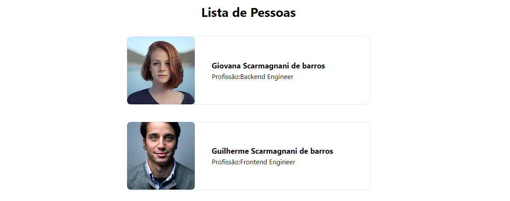

# Teste IBS

<!---Esses são exemplos. Veja https://shields.io para outras pessoas ou para personalizar este conjunto de escudos. Você pode querer incluir dependências, status do projeto e informações de licença aqui--->
<p align="center">
  
</p>

> Teste de CRUD para empresa IBS.

## 💻 Pré-requisitos

Antes de começar, verifique se você atendeu aos seguintes requisitos:
<!---Estes são apenas requisitos de exemplo. Adicionar, duplicar ou remover conforme necessário--->
* Node.
* NPM.

## 🚀 Instalando Teste IBS

Para instalar o Teste, siga estas etapas:


Clone este repositório
```
git clone <nome do repositorio>
```

## ☕ Usando o Teste IBS

Para usar o Teste, siga estas etapas:

1 - Entre na pasta API
```
cd api
```

2 - Instale as dependencias da API
```
npm install
```

3 - Inicie a API 

```
npm run dev
```


4 - Entre na pasta do Frontend
```
npm install
```


5 - Instale as dependencias do Frontend
```
npm install
```

4 - Inicie o Frontend 

```
npm run dev
```

## ✅ Features

Pessoa:  
Listar Pessoas.  
Criar Pessoa.  
Editar Pessoa.  
Remover Pessoa.  

Profissão:  
Listar Profissões.  
Criar Profissão.  
Editar Profissão.  
Remover Profissão.  

## 🧑🏻‍💻 Tecnologias   
* Nuxt 3. 
* Vue 3.
* Typescript. 
* TailwindCSS.
* NodeJS.  
* Express.  

## 🤝 Colaboradores

Agradecemos às seguintes pessoas que contribuíram para este projeto:

<table>
  <tr>
    <td align="center">
      <a href="#">
        <br>
        <sub>
          <b>Guilherme S Barros</b>
        </sub>
      </a>
    </td>
  </tr>
</table>

## 📝 Licença

Esse projeto está sob licença. Veja o arquivo [LICENÇA](LICENSE.md) para mais detalhes.

[⬆ Voltar ao topo](#TesteIBS)<br>
